<div align="center">

# 🎓 DataExtract RAG

### Intelligent Educational Content Processing Platform

[](https://python.org)
[](https://fastapi.tiangolo.com)
[](https://groq.com)
[](https://mongodb.com)

*A self-learning multimodal RAG system with confidence scoring, internet fallback, and cloud-powered AI*

[Features](#-features) • [Architecture](#-architecture) • [Installation](#-installation) • [API](#-api-endpoints) • [Demo](#-demo)

</div>

---

## ✨ Features

<table>
<tr>
<td width="50%">

### 🧠 Smart RAG with Self-Learning
- **Confidence Scoring** - Every answer shows 0-100% confidence
- **Internet Fallback** - Uses LLM knowledge when local docs fail  
- **Auto-Learning** - Saves high-confidence answers for future use
- **Source Attribution** - Shows where each answer came from

</td>
<td width="50%">

### ☁️ Cloud-Powered AI (FREE Tier)
- **Groq LLaMA 3.3 70B** - Ultra-fast inference (14,400 req/day)
- **Groq Whisper Large-v3** - Accurate transcription
- **Cohere Embed v3** - State-of-the-art embeddings (1024d)
- **Automatic Fallback** - Local processing if cloud unavailable

</td>
</tr>
<tr>
<td width="50%">

### 📄 Multimodal Processing
- **PDFs** - Text extraction + OCR for scans
- **Images** - OCR + BLIP captioning  
- **Audio** - Whisper transcription
- **Video** - Frame extraction + audio transcription

</td>
<td width="50%">

### 🎯 Educational Focus
- **Teacher Persona** - Friendly, helpful responses
- **Step-by-Step** - Clear explanations with examples
- **Code Blocks** - Syntax-highlighted code snippets
- **Math Support** - Formatted equations and solutions

</td>
</tr>
</table>

---

## 🏗️ Architecture

### System Overview


### Smart Query Flow

```mermaid
flowchart LR
    A[📝 Question] --> B{🔍 Check Learned DB}
    B -->|Found| C[✅ Return Saved Answer]
    B -->|Not Found| D[📄 Search Local Docs]
    D --> E[🤖 Generate + Score]
    E --> F{Confidence ≥ 60%?}
    F -->|Yes| G[✅ Return Answer]
    F -->|No| H[⚠️ Show + Offer Internet]
    H --> I{User Clicks Search}
    I -->|Yes| J[🌐 Internet Search]
    J --> K{Confidence ≥ 90%?}
    K -->|Yes| L[💾 Save to Learned DB]
    K -->|No| M[📤 Return Answer]
    L --> M
```



---

## 🛠️ Tech Stack

| Layer | Technology | Purpose |
|-------|-----------|---------|
| **API** | FastAPI | High-performance async REST API |
| **LLM** | Groq (LLaMA 3.3 70B) | Ultra-fast cloud inference |
| **Transcription** | Groq Whisper Large-v3 | Accurate audio/video transcription |
| **Embeddings** | Cohere Embed v3 | 1024-dimensional semantic embeddings |
| **Vector Store** | FAISS | Efficient similarity search |
| **Database** | MongoDB Atlas | Document metadata + learned answers |
| **OCR** | PaddleOCR + Tesseract | Text extraction from images |
| **Vision** | OpenCV + BLIP | Image processing + captioning |
| **Audio/Video** | FFmpeg + Whisper | Media processing |

### Local Fallback Stack
| Component | Fallback |
|-----------|----------|
| LLM | Ollama (LLaMA 3.2 3B) |
| Whisper | Local Whisper Tiny |
| Embeddings | BGE-base-en (768d) |

---

## 📁 Project Structure

```
DataExtract_model/
├── app/
│   ├── main.py                    # FastAPI entry + health checks
│   ├── config.py                  # Configuration + cloud API settings
│   │
│   ├── api/
│   │   ├── upload.py              # File upload endpoints
│   │   └── query.py               # Smart RAG query endpoints
│   │
│   ├── core/
│   │   ├── router.py              # File type detection
│   │   ├── ingestion.py           # Processing pipeline
│   │   ├── chunking.py            # Semantic text chunking
│   │   ├── embeddings.py          # Cohere/BGE embeddings
│   │   └── llm.py                 # Groq/Ollama LLM + confidence scoring
│   │
│   ├── processors/
│   │   ├── pdf.py                 # PDF text + OCR extraction
│   │   ├── audio.py               # Audio transcription
│   │   ├── video.py               # Video frame + audio processing
│   │   └── image.py               # Image OCR + captioning
│   │
│   ├── storage/
│   │   ├── vector_store.py        # FAISS vector operations
│   │   ├── metadata_db.py         # MongoDB metadata
│   │   └── learned_answers.py     # Self-learning answer storage
│   │
│   └── utils/
│       ├── ocr.py                 # PaddleOCR utilities
│       └── text_cleaner.py        # Text preprocessing
│
├── static/
│   ├── index.html                 # Web interface
│   ├── app.js                     # Frontend JavaScript
│   └── styles.css                 # Modern dark theme
│
├── data/
│   ├── uploads/                   # Uploaded files
│   ├── processed/                 # Extracted content
│   └── faiss/                     # Vector index storage
│
├── .env                           # API keys (not in git)
├── .env.example                   # Environment template
└── requirements.txt               # Python dependencies
```

---

## 🚀 Installation

### Prerequisites
- Python 3.10+
- FFmpeg (for audio/video)
- MongoDB Atlas account (free)
- Groq API key (free)
- Cohere API key (free)

### 1. Clone & Setup

```bash
git clone https://github.com/yourusername/dataextract-rag.git
cd dataextract-rag

# Create virtual environment
python -m venv venv
venv\Scripts\activate  # Windows
source venv/bin/activate  # Linux/Mac

# Install dependencies
pip install -r requirements.txt
```

### 2. Get FREE API Keys

| Service | Link | Free Tier |
|---------|------|-----------|
| **Groq** | [console.groq.com](https://console.groq.com) | 14,400 requests/day |
| **Cohere** | [dashboard.cohere.com](https://dashboard.cohere.com) | 1,000 requests/min |
| **MongoDB** | [cloud.mongodb.com](https://cloud.mongodb.com) | 512MB free |

### 3. Configure Environment

```bash
# Copy template
cp .env.example .env

# Edit .env with your keys
GROQ_API_KEY=your_groq_key
COHERE_API_KEY=your_cohere_key
MONGODB_URI=your_mongodb_connection_string
```

### 4. Run the Server

```bash
python -m uvicorn app.main:app --reload
```

Open **http://localhost:8000** in your browser! 🎉

---

## 📡 API Endpoints

### Upload Documents

```bash
# Upload file for processing
curl -X POST "http://localhost:8000/upload/" \
  -F "file=@lecture.pdf"
```

**Response:**
```json
{
  "file_name": "lecture.pdf",
  "file_type": "pdf",
  "chunks_created": 45,
  "status": "success"
}
```

### Smart Query (with Confidence)

```bash
curl -X POST "http://localhost:8000/query/" \
  -H "Content-Type: application/json" \
  -d '{"question": "What is machine learning?"}'
```

**Response:**
```json
{
  "question": "What is machine learning?",
  "answer": "Machine learning is a subset of AI...",
  "confidence_score": 85,
  "source": "local_db",
  "offer_internet": false,
  "sources": [{"file": "lecture.pdf", "chunk_id": 12}]
}
```

### Internet Search (Fallback)

```bash
curl -X POST "http://localhost:8000/query/internet" \
  -H "Content-Type: application/json" \
  -d '{"question": "What is quantum computing?"}'
```

**Response:**
```json
{
  "answer": "Quantum computing uses quantum mechanics...",
  "confidence_score": 92,
  "source": "internet",
  "saved_to_db": true
}
```

---

## 🖼️ Demo

### Dashboard
The modern dark-themed interface shows:
- 📊 System health status
- 📈 Vector store statistics  
- 🔄 Real-time activity log

### Query Interface
- 💬 Chat-style Q&A
- 🏷️ Confidence badges (High/Medium/Low)
- 🌐 Internet search button
- 📄 Source attribution

### Confidence Scoring
| Score | Badge | Action |
|-------|-------|--------|
| 80-100% | 🟢 High | Return answer |
| 60-79% | 🟡 Medium | Return answer |
| <60% | 🔴 Low | Offer internet search |

---

## 📂 Supported File Types

| Type | Extensions | Processing |
|------|------------|------------|
| **PDF** | `.pdf` | Text extraction + OCR |
| **Images** | `.jpg`, `.png` | OCR + BLIP captioning |
| **Audio** | `.mp3`, `.wav` | Whisper transcription |
| **Video** | `.mp4` | Frame + audio extraction |

---

## ⚙️ Configuration

Key settings in `.env`:

```env
# Cloud APIs (FREE)
GROQ_API_KEY=gsk_xxx
COHERE_API_KEY=xxx

# Database
MONGODB_URI=mongodb+srv://...

# Toggle cloud/local
USE_CLOUD_LLM=true
USE_CLOUD_WHISPER=true
USE_CLOUD_EMBEDDINGS=true
```

Thresholds in `app/api/query.py`:
```python
LOCAL_DB_THRESHOLD = 60   # Below this, offer internet
LEARNING_THRESHOLD = 90   # Above this, save to DB
```

---

## 🤝 Contributing

1. Fork the repository
2. Create feature branch (`git checkout -b feature/amazing`)
3. Commit changes (`git commit -m 'Add amazing feature'`)
4. Push to branch (`git push origin feature/amazing`)
5. Open a Pull Request


<div align="center">

**Made with ❤️ for Education**

[⬆ Back to Top](#-dataextract-rag)

</div>
